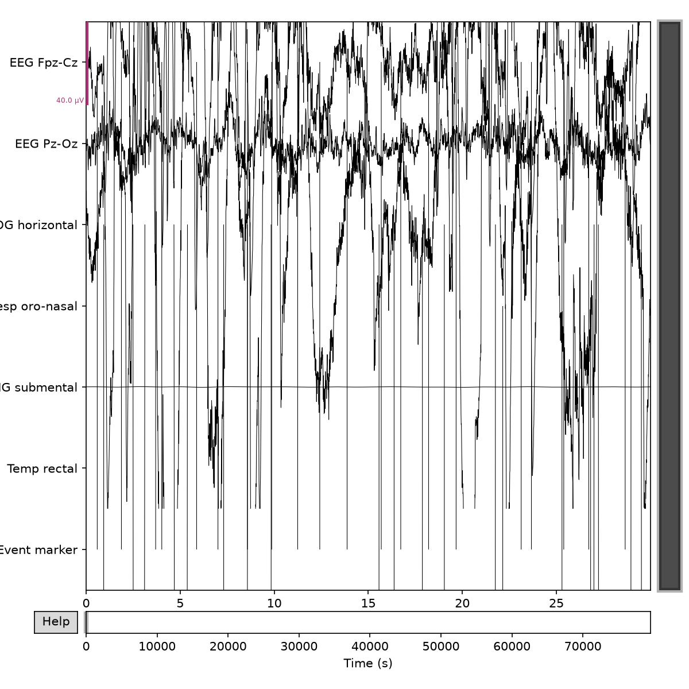

# Ageing, sleep and dementia EEG: a learning project

> 🚧 **Work in progress.** I'm building this pipeline step by step, from my first EEG file to a simple classifier, so the repo shows each stage of learning as well as the final analysis.

## Motivation

EEG slowing (more theta power, less alpha power) is one of the most consistently reported neurophysiological changes in Alzheimer's disease. Sleep also changes with age and is closely tied to dementia risk. This project uses **open data only** to build a reproducible Python/MNE pipeline that:

1. describes how sleep EEG differs between younger and older adults, and
2. compares resting-state EEG across **Alzheimer's disease (AD)**, **frontotemporal dementia (FTD)**, and **cognitively normal (CN)** older adults.

My background is in speech-language pathology and psychology, with a focus on hearing, cognition, and dementia. This repo is my hands-on training in EEG signal processing, done ahead of PhD study.

## Roadmap

**Stage 1: Sleep EEG** (Sleep-EDF)

- [x] **Level 1:** Load a Sleep-EDF recording and plot the first 30 s of EEG → [`analysis/01_first_eeg.ipynb`](analysis/01_first_eeg.ipynb)
- [ ] **Level 2:** Set channel types, crop to the night period, and compare hypnograms of a younger vs an older (70+) participant
- [ ] **Level 3:** Power spectral density (PSD) by sleep stage

**Stage 2: Resting-state EEG in dementia** (OpenNeuro ds004504)

- [ ] **Level 4:** Load BIDS data; preprocessing (filtering, artifact rejection)
- [ ] **Level 5:** Band power (delta, theta, alpha, beta) across AD, FTD, and CN
- [ ] **Level 6:** Group statistics and scalp topographies
- [ ] **Level 7:** A simple classifier (AD vs CN) with cross-validation
- [ ] **Level 8:** Clean up the repo and write a one-page summary

## Data

Raw data are **not** stored in this repository. Notebooks download them from the original sources into `data/`, which is git-ignored.

| Dataset | Content | Used in |
|---|---|---|
| [Sleep-EDF Expanded](https://physionet.org/content/sleep-edfx/) (PhysioNet) | Overnight polysomnography from healthy adults aged 25–101, with expert sleep-stage annotations | Levels 1–3 |
| [OpenNeuro ds004504](https://openneuro.org/datasets/ds004504) | Resting-state, eyes-closed scalp EEG from people with AD, FTD, and cognitively normal controls | Levels 4–8 |

## Repository layout

```
analysis/   one notebook per level
figures/    output figures from each level
data/       downloaded raw data (git-ignored)
```

## How to run

This project uses [uv](https://docs.astral.sh/uv/) and Python 3.11.

```bash
git clone https://github.com/amy95031/ageing-sleep-dementia-eeg.git
cd ageing-sleep-dementia-eeg
uv sync
uv run jupyter lab
```

Then open a notebook in `analysis/` and run it from top to bottom. The first run downloads the data it needs.

## Example output

Level 1: the first 30 seconds of a Sleep-EDF recording (channel types not yet set; that comes in Level 2).



## References

- Kemp, B., Zwinderman, A. H., Tuk, B., Kamphuisen, H. A. C., & Oberyé, J. J. L. (2000). Analysis of a sleep-dependent neuronal feedback loop: The slow-wave microcontinuity of the EEG. *IEEE Transactions on Biomedical Engineering*, 47(9), 1185–1194.
- Goldberger, A. L., et al. (2000). PhysioBank, PhysioToolkit, and PhysioNet: Components of a new research resource for complex physiologic signals. *Circulation*, 101(23), e215–e220.
- Miltiadous, A., et al. (2023). A dataset of scalp EEG recordings of Alzheimer's disease, frontotemporal dementia and healthy subjects from routine EEG. *Data*, 8(6), 95.
- Gramfort, A., et al. (2013). MEG and EEG data analysis with MNE-Python. *Frontiers in Neuroscience*, 7, 267.

## Author

**Chia-Yu (Millie) Liu** · [ORCID](https://orcid.org/0000-0002-3017-9916) · [GitHub profile](https://github.com/amy95031)
